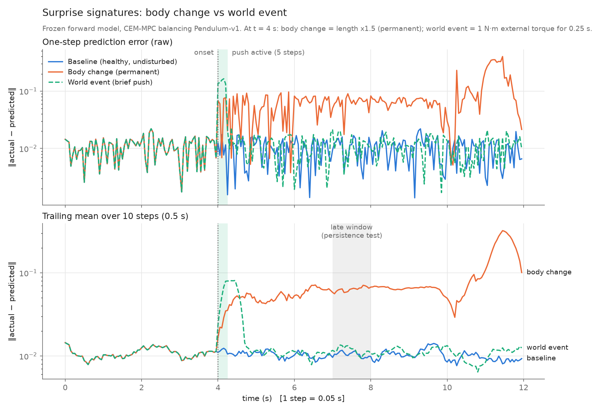
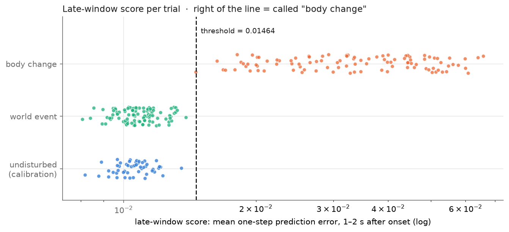
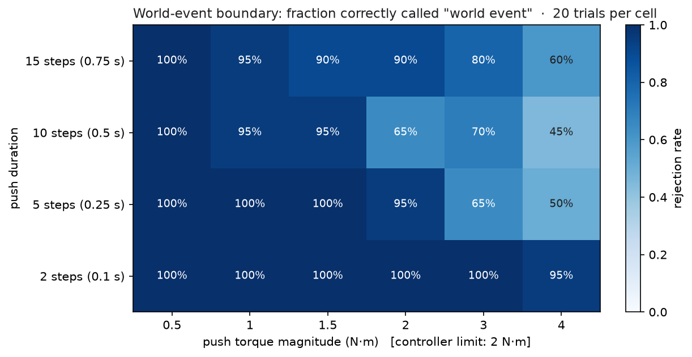
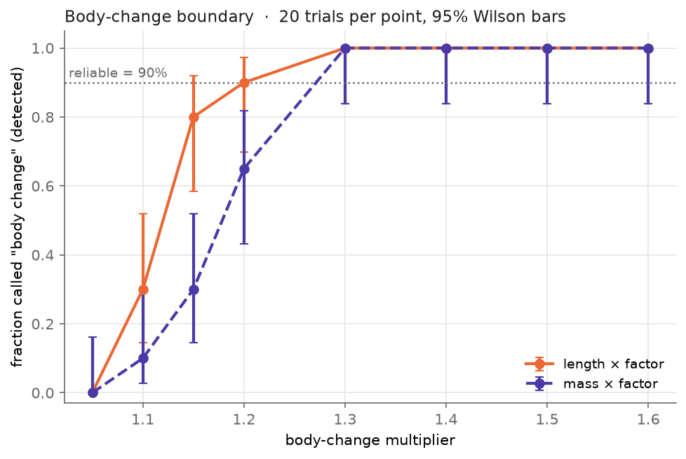

# Surprise attribution: body change vs world event

A frozen forward model (the pendulum's self-model) is used to balance
Pendulum-v1 with CEM-MPC. At every step we log its one-step prediction error,
the "surprise". Partway through, one of two things happens:

- **body change**: a physical parameter is permanently altered (default: length ×1.5)
- **world event**: an external torque the model can't see acts for 5 steps, then stops

The question is whether the *shape* of the surprise tells you which one it was.

```
python run_experiment.py            # train/load model, run 3 conditions, CSVs, figure, features
python run_experiment.py --retrain  # same, but train a fresh forward model first
python plot.py                      # re-draw the figure from the CSVs
python env_setup.py                 # check the push-capable physics == stock Pendulum-v1
```

Dependencies: numpy, torch, gymnasium, matplotlib. The whole run takes about 10 s on CPU.

## Files

| file | what it does |
|---|---|
| `config.py` | **every knob**: disturbance timing, type, magnitude, feature windows, seeds |
| `env_setup.py` | stock `Pendulum-v1` plus the two disturbance channels, and a physics equivalence check |
| `model.py` | the forward model (MLP 4→64→64→3, MSE), data collection, training, save/load. **This is where your own model goes** |
| `planner.py` | CEM-MPC that plans through the forward model |
| `run_experiment.py` | runs the conditions, computes the surprise signal, writes the CSVs, calls plot and features |
| `features.py` | summary features: before vs after, and persistence |
| `plot.py` | the figure |

### Using your own forward model

The rest of the code only calls `model.predict_next(states, actions) -> next_states`,
on batched float32 tensors of shape `(N,3)`, `(N,1)` → `(N,3)`, in state space.
Wrap your model so it exposes that method and return it from `model.load_model()`.
The docstring at the top of `model.py` has the details.

## Outputs (`results/`)

- `baseline.csv`, `body_change.csv`, `world_event.csv`: one row per step. Columns:
  `surprise` (the error norm), per-dimension residuals, action, external torque,
  current length/mass, θ, θ̇, and an `event` marker.
- `surprise_signatures.png`: all three signals, raw (top) and smoothed (bottom), log scale.
- `summary_features.csv`: the table below.

## Result (seed 0, defaults)



| condition | pre mean | post/pre | peak | late/pre | still elevated? |
|---|---|---|---|---|---|
| baseline | 1.13e-02 | 0.95 | 1.74e-02 | 0.91 | no |
| body change (l ×1.5) | 1.13e-02 | 4.53 | 9.22e-02 | **5.71** | **YES** |
| world event (1 N·m, 5 steps) | 1.13e-02 | 4.09 | **1.64e-01** | **1.06** | **no** |

- **Before vs after (feature a)** can't separate them. Both jump about 4× right
  after the onset. It tells you *that* something happened.
- **Persistence (feature b)** does separate them. Three seconds later the body-change error is
  still 5.7× its pre-onset level. The world-event error is back to 1.06×.
- The world event has the **bigger** spike (0.164 vs 0.092), so peak size isn't
  the thing doing the separating.

Quick robustness check, 8 seeds per condition (not part of the saved outputs):

| condition | still elevated | mean peak | mean late/pre |
|---|---|---|---|
| baseline | 0/8 | 0.020 | 1.04 |
| body: length ×1.5 | 8/8 | 0.088 | 5.26 |
| body: mass ×1.5 | 7/8 | 0.067 | 4.56 |
| world: 1 N·m push | 0/8 | 0.159 | 0.98 |
| world: 2 N·m push | 0/8 | 0.306 | 0.99 |

## Caveats you should be ready to defend

- **The body-change pendulum eventually falls over** (~10 s in the default run).
  A longer pendulum needs more torque to hold at a given angle, the controller
  is limited to ±2 N·m, and the model's persistent mismatch causes a slow drift
  that ends up past the recoverable angle. The late window (7–8 s) sits *before*
  the fall (|θ| ≈ 0.15–0.2 rad), so the "still elevated" result isn't caused
  by falling. But if you move `LATE_LAG` later, you'll be measuring a fallen
  pendulum. `run_experiment.py` prints the final |θ| of each run so you can check.
- **Mass only matters through torque.** In Pendulum-v1, `m` appears only in
  `3/(m l²)·u`. A mass change is invisible while `u ≈ 0`. It shows up here
  because the drifting controller is actively pushing. For the same reason
  a mass change is exactly equivalent to a weaker motor. No self-model can tell
  those two apart on this body. (See `../Rung 4/identifiability.py`.)
- **The error norm is dominated by θ̇.** θ̇ is unbounded rad/s, while cos/sin lie in
  [−1, 1]. Every disturbance here acts on angular acceleration, so that's fine,
  but the per-dimension residuals are in the CSVs if you need them.
- **One episode per condition** is what the saved outputs contain. The 8-seed table
  above is the evidence that the pattern isn't a one-seed accident.
- **Threshold choice.** "Still elevated" means late mean > pre mean + 4 σ, both taken from
  the episode's own pre-onset window. The rule doesn't depend on any disturbed data.

## Relation to `Rung 4/`

`Rung 4/` in this repo already runs a bigger version of the same experiment:
7 conditions × 20 seeds, a peak-matched push calibration, and a
detect-then-classify pipeline. It depends on code in `Rung 1/` and `Rung 3/`.
This folder is a self-contained, minimal version of the core measurement: one
episode per condition, the Euclidean error norm (Rung 4 used per-step MSE), and every
parameter in one config file. Treat it as the clean base to extend.

## Quantified classifier (`evaluate_classifier.py`)

The single-episode demo above shows the signature exists. This part turns it
into a decision rule and measures how often the rule is right over many
randomised trials.

```
python evaluate_classifier.py            # full run, ~5 min on 4 cores
python evaluate_classifier.py --quick    # tiny smoke test -> results_classifier_quick/
```

### The rule (`classifier.py`)

```
score      = mean one-step error over [onset + 1 s, onset + 2 s)
prediction = "body change" if score > threshold else "world event"
```

The score is the trailing mean of the error at onset + 2 s, over the preceding
1 s, so it only uses the past. The threshold is calibrated from **undisturbed**
episodes only (mean + 4 std of their late-window scores). It never sees either
test class. The classifier is given the true onset. Detecting the onset is a
separate problem, so this measures attribution, not detection.

### What gets run

| block | trials | what is randomised |
|---|---|---|
| calibration | 50 undisturbed | start state, onset |
| main | 100 body + 100 world | start state, onset 2–4 s; body: length or mass × U[1.2, 1.6]; world: ±U[0.5, 2.0] N·m for 2–10 steps |
| boundary, body | 2 params × 8 factors × 20 | factor fixed at 1.05 … 1.6 |
| boundary, world | 6 torques × 4 durations × 20 | torque 0.5 … 4 N·m, duration 0.1 … 0.75 s |

All ranges, window, threshold, trial counts and the "reliable" rate (90%) are
in `classify_config.py`.

### Metrics (`metrics.py`)

- Positive class = body change.
- **False-positive rate** = world events called "body change". **This is the
  safety-critical number.** A false positive makes the robot rewrite a correct
  self-model to fit a push that is already over.
- False-negative rate = body changes called "world event". This leaves a stale
  model, but the error stays high, so it can be caught later.
- Every rate comes with a 95% Wilson interval.
- The ROC sweeps the threshold over all observed scores. Choosing a threshold
  off that curve and re-scoring the same trials is in-sample, so confirm a
  chosen threshold on fresh seeds.

### Outputs (`results_classifier/`)

`calibration_trials.csv`, `main_trials.csv`, `boundary_trials.csv` (one row per
trial: full spec, score, prediction, whether the pendulum had fallen),
`roc.csv`, `boundary_body.csv`, `boundary_world.csv`, `summary.txt`, and
`scores.png`, `confusion.png`, `roc.png`, `boundary_body.png`,
`boundary_world.png`.

### Results (default config, one full run)

Threshold from 50 undisturbed episodes: mean 0.01058 + 4 × 0.001014 = **0.01464**.

**Main evaluation, 100 + 100 randomised trials**

| | pred: body change | pred: world event |
|---|---|---|
| true: body change | 99 | 1 |
| true: world event | 0 | 100 |

| metric | value | 95% Wilson CI |
|---|---|---|
| accuracy | 99.5% | 97.2–99.9% |
| **false-positive rate (safety-critical)** | **0.0%** | **0.0–3.7%** |
| false-negative rate | 1.0% | 0.2–5.4% |

- **The single miss:** a mass ×1.26 change scoring 0.01461 against a threshold of 0.01464.
- **Length changes:** 62/62 detected. Mass changes: 37/38.
- **AUC 1.000** on these trials. That's because the random ranges keep the two classes apart, not because the rule is perfect.
- **The margin is thin.** The highest world-event score is 0.01386 and the lowest body-change score is 0.01461.
- **Falling doesn't explain it.** 10 world-event trials had knocked the pendulum over by the end of the window, and all 10 were still correctly called "world". A pendulum swinging freely is predicted well.



**Boundary (20 trials per setting, same threshold, "reliable" = ≥ 90% correct)**

- **Smallest body change reliably detected:** length ×1.2, mass ×1.3. Below that, detection falls off: length ×1.1 30%, mass ×1.1 10%, both ×1.05 0%. Mass is harder because it only enters the torque term.
- **Largest push reliably rejected,** by duration:
  - 0.1 s: 4 N·m (all tested torques)
  - 0.25 s: 2 N·m
  - 0.5 s: 1.5 N·m
  - 0.75 s: 2 N·m
  
  The 0.5 s and 0.75 s rows are not monotone; with 20 trials per cell, adjacent cells are within noise.
- **What the rejection failures are.** Of 62 rejection failures, only 3 had fallen. Their median |θ| at the end of the window was 0.20 rad, against 0.07 for correct rejections. These are large pushes the controller was still recovering from inside the 1–2 s window. That is the real limit of a fixed-lag rule: a big enough push takes longer than 1 s to settle.



