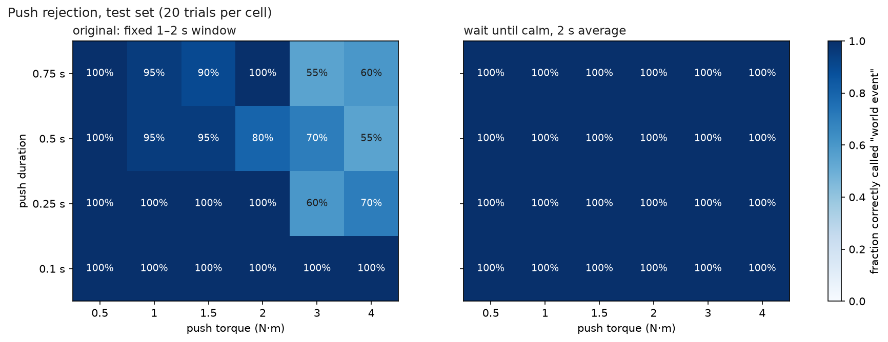
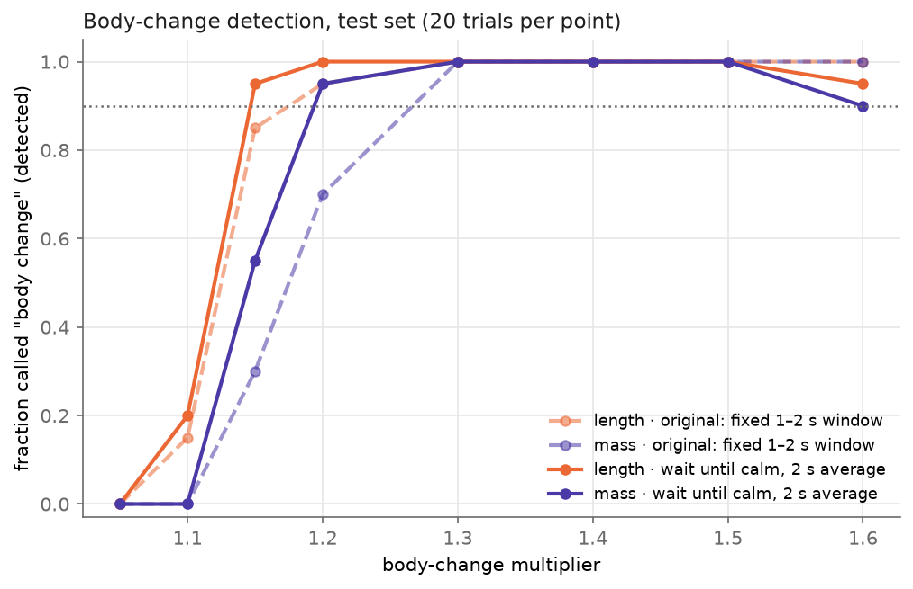
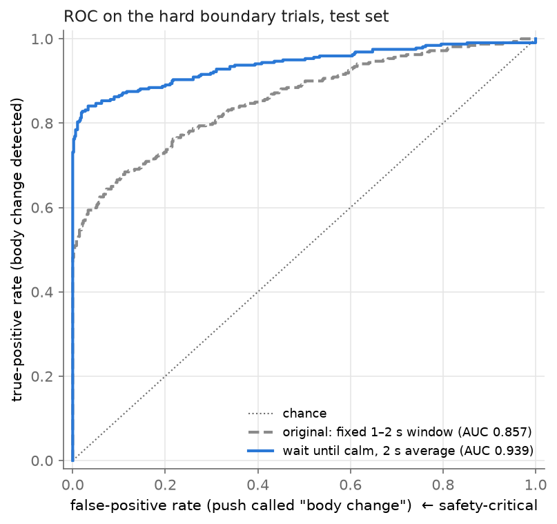
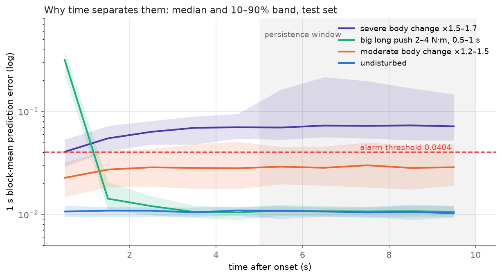
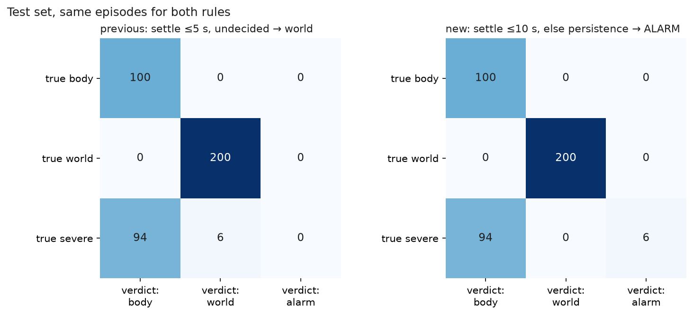
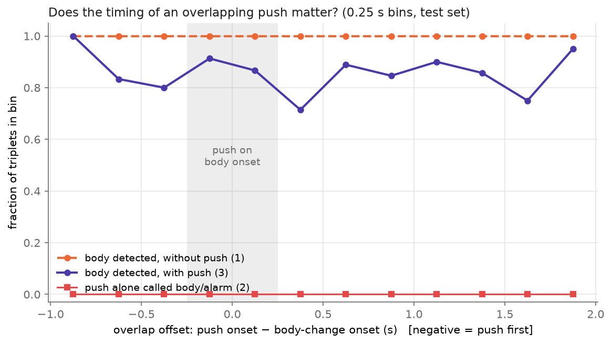
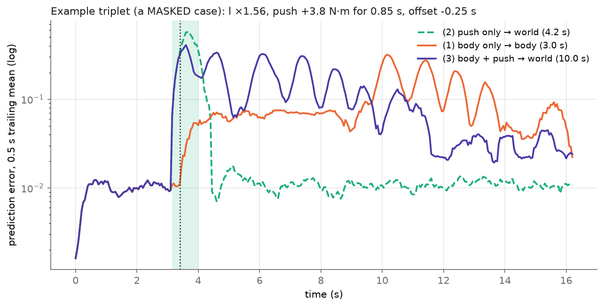

# Surprise attribution: body change vs world event

A frozen forward model (the pendulum's self-model) is used to balance
Pendulum-v1 with CEM-MPC. At every step we log its one-step prediction error,
the "surprise". Partway through, one of two things happens:

- **body change**: a physical parameter is permanently altered (default: length ×1.5)
- **world event**: an external torque the model can't see acts for 5 steps, then stops

The question is whether the *shape* of the surprise tells you which one it was.

```
python run_experiment.py            # train/load model, run 3 conditions, CSVs, figure, features
python run_experiment.py --retrain  # same, but train a fresh forward model first
python plot.py                      # re-draw the figure from the CSVs
python env_setup.py                 # check the push-capable physics == stock Pendulum-v1
```

Dependencies: numpy, torch, gymnasium, matplotlib. The whole run takes about 10 s on CPU.

## Files

| file | what it does |
|---|---|
| `config.py` | **every knob**: disturbance timing, type, magnitude, feature windows, seeds |
| `env_setup.py` | stock `Pendulum-v1` plus the two disturbance channels, and a physics equivalence check |
| `model.py` | the forward model (MLP 4→64→64→3, MSE), data collection, training, save/load. **This is where your own model goes** |
| `planner.py` | CEM-MPC that plans through the forward model |
| `run_experiment.py` | runs the conditions, computes the surprise signal, writes the CSVs, calls plot and features |
| `features.py` | summary features: before vs after, and persistence |
| `plot.py` | the figure |

### Using your own forward model

The rest of the code only calls `model.predict_next(states, actions) -> next_states`,
on batched float32 tensors of shape `(N,3)`, `(N,1)` → `(N,3)`, in state space.
Wrap your model so it exposes that method and return it from `model.load_model()`.
The docstring at the top of `model.py` has the details.

## Outputs (`results/`)

- `baseline.csv`, `body_change.csv`, `world_event.csv`: one row per step. Columns:
  `surprise` (the error norm), per-dimension residuals, action, external torque,
  current length/mass, θ, θ̇, and an `event` marker.
- `surprise_signatures.png`: all three signals, raw (top) and smoothed (bottom), log scale.
- `summary_features.csv`: the table below.

## Result (seed 0, defaults)


| condition | pre mean | post/pre | peak | late/pre | still elevated? |
|---|---|---|---|---|---|
| baseline | 1.13e-02 | 0.95 | 1.74e-02 | 0.91 | no |
| body change (l ×1.5) | 1.13e-02 | 4.53 | 9.22e-02 | **5.71** | **YES** |
| world event (1 N·m, 5 steps) | 1.13e-02 | 4.09 | **1.64e-01** | **1.06** | **no** |

- **Before vs after (feature a)** can't separate them. Both jump about 4× right
  after the onset. It tells you *that* something happened.
- **Persistence (feature b)** does separate them. Three seconds later the body-change error is
  still 5.7× its pre-onset level. The world-event error is back to 1.06×.
- The world event has the **bigger** spike (0.164 vs 0.092), so peak size isn't
  the thing doing the separating.

Quick robustness check, 8 seeds per condition (not part of the saved outputs):

| condition | still elevated | mean peak | mean late/pre |
|---|---|---|---|
| baseline | 0/8 | 0.020 | 1.04 |
| body: length ×1.5 | 8/8 | 0.088 | 5.26 |
| body: mass ×1.5 | 7/8 | 0.067 | 4.56 |
| world: 1 N·m push | 0/8 | 0.159 | 0.98 |
| world: 2 N·m push | 0/8 | 0.306 | 0.99 |

## Caveats you should be ready to defend

- **The body-change pendulum eventually falls over** (~10 s in the default run).
  A longer pendulum needs more torque to hold at a given angle, the controller
  is limited to ±2 N·m, and the model's persistent mismatch causes a slow drift
  that ends up past the recoverable angle. The late window (7–8 s) sits *before*
  the fall (|θ| ≈ 0.15–0.2 rad), so the "still elevated" result isn't caused
  by falling. But if you move `LATE_LAG` later, you'll be measuring a fallen
  pendulum. `run_experiment.py` prints the final |θ| of each run so you can check.
- **Mass only matters through torque.** In Pendulum-v1, `m` appears only in
  `3/(m l²)·u`. A mass change is invisible while `u ≈ 0`. It shows up here
  because the drifting controller is actively pushing. For the same reason
  a mass change is exactly equivalent to a weaker motor. No self-model can tell
  those two apart on this body. (See `../Rung 4/identifiability.py`.)
- **The error norm is dominated by θ̇.** θ̇ is unbounded rad/s, while cos/sin lie in
  [−1, 1]. Every disturbance here acts on angular acceleration, so that's fine,
  but the per-dimension residuals are in the CSVs if you need them.
- **One episode per condition** is what the saved outputs contain. The 8-seed table
  above is the evidence that the pattern isn't a one-seed accident.
- **Threshold choice.** "Still elevated" means late mean > pre mean + 4 σ, both taken from
  the episode's own pre-onset window. The rule doesn't depend on any disturbed data.

## Relation to `Rung 4/`

`Rung 4/` in this repo already runs a bigger version of the same experiment:
7 conditions × 20 seeds, a peak-matched push calibration, and a
detect-then-classify pipeline. It depends on code in `Rung 1/` and `Rung 3/`.
This folder is a self-contained, minimal version of the core measurement: one
episode per condition, the Euclidean error norm (Rung 4 used per-step MSE), and every
parameter in one config file. Treat it as the clean base to extend.

## Quantified classifier (`evaluate_classifier.py`)

The single-episode demo above shows the signature exists. This part turns it
into a decision rule and measures how often the rule is right over many
randomised trials.

```
python evaluate_classifier.py            # full run, ~5 min on 4 cores
python evaluate_classifier.py --quick    # tiny smoke test -> results_classifier_quick/
```

### The rule (`classifier.py`)

```
score      = mean one-step error over [onset + 1 s, onset + 2 s)
prediction = "body change" if score > threshold else "world event"
```

The score is the trailing mean of the error at onset + 2 s, over the preceding
1 s, so it only uses the past. The threshold is calibrated from **undisturbed**
episodes only (mean + 4 std of their late-window scores). It never sees either
test class. The classifier is given the true onset. Detecting the onset is a
separate problem, so this measures attribution, not detection.

### What gets run

| block | trials | what is randomised |
|---|---|---|
| calibration | 50 undisturbed | start state, onset |
| main | 100 body + 100 world | start state, onset 2–4 s; body: length or mass × U[1.2, 1.6]; world: ±U[0.5, 2.0] N·m for 2–10 steps |
| boundary, body | 2 params × 8 factors × 20 | factor fixed at 1.05 … 1.6 |
| boundary, world | 6 torques × 4 durations × 20 | torque 0.5 … 4 N·m, duration 0.1 … 0.75 s |

All ranges, window, threshold, trial counts and the "reliable" rate (90%) are
in `classify_config.py`.

### Metrics (`metrics.py`)

- Positive class = body change.
- **False-positive rate** = world events called "body change". **This is the
  safety-critical number.** A false positive makes the robot rewrite a correct
  self-model to fit a push that is already over.
- False-negative rate = body changes called "world event". This leaves a stale
  model, but the error stays high, so it can be caught later.
- Every rate comes with a 95% Wilson interval.
- The ROC sweeps the threshold over all observed scores. Choosing a threshold
  off that curve and re-scoring the same trials is in-sample, so confirm a
  chosen threshold on fresh seeds.

### Outputs (`results_classifier/`)

`calibration_trials.csv`, `main_trials.csv`, `boundary_trials.csv` (one row per
trial: full spec, score, prediction, whether the pendulum had fallen),
`roc.csv`, `boundary_body.csv`, `boundary_world.csv`, `summary.txt`, and
`scores.png`, `confusion.png`, `roc.png`, `boundary_body.png`,
`boundary_world.png`.

### Results (default config, one full run)

Threshold from 50 undisturbed episodes: mean 0.01058 + 4 × 0.001014 = **0.01464**.

**Main evaluation, 100 + 100 randomised trials**

| | pred: body change | pred: world event |
|---|---|---|
| true: body change | 99 | 1 |
| true: world event | 0 | 100 |

| metric | value | 95% Wilson CI |
|---|---|---|
| accuracy | 99.5% | 97.2–99.9% |
| **false-positive rate (safety-critical)** | **0.0%** | **0.0–3.7%** |
| false-negative rate | 1.0% | 0.2–5.4% |

- **The single miss:** a mass ×1.26 change scoring 0.01461 against a threshold of 0.01464.
- **Length changes:** 62/62 detected. Mass changes: 37/38.
- **AUC 1.000** on these trials. That's because the random ranges keep the two classes apart, not because the rule is perfect.
- **The margin is thin.** The highest world-event score is 0.01386 and the lowest body-change score is 0.01461.
- **Falling doesn't explain it.** 10 world-event trials had knocked the pendulum over by the end of the window, and all 10 were still correctly called "world". A pendulum swinging freely is predicted well.


**Boundary (20 trials per setting, same threshold, "reliable" = ≥ 90% correct)**

- **Smallest body change reliably detected:** length ×1.2, mass ×1.3. Below that, detection falls off: length ×1.1 30%, mass ×1.1 10%, both ×1.05 0%. Mass is harder because it only enters the torque term.
- **Largest push reliably rejected,** by duration:
  - 0.1 s: 4 N·m (all tested torques)
  - 0.25 s: 2 N·m
  - 0.5 s: 1.5 N·m
  - 0.75 s: 2 N·m
  
  The 0.5 s and 0.75 s rows are not monotone; with 20 trials per cell, adjacent cells are within noise.
- **What the rejection failures are.** Of 62 rejection failures, only 3 had fallen. Their median |θ| at the end of the window was 0.20 rad, against 0.07 for correct rejections. These are large pushes the controller was still recovering from inside the 1–2 s window. That is the real limit of a fixed-lag rule: a big enough push takes longer than 1 s to settle.


## Fixing the weak spots (`compare_rules.py`)

```
python compare_rules.py dev     # score 6 candidate rules on a development set, pick one
python compare_rules.py test    # evaluate the pick vs the original on fresh seeds
```

### Why the original rule failed on big pushes

After a big push the pendulum swings fast for 1–2 s, up to about 7 rad/s
against about 0.05 while balancing. Often it is knocked all the way down and
swung back up. The healthy model is less accurate at speed, and right after a
recovery the controller is still working hard. So a fixed 1–2 s window
measures the push's after-effects, not a wrong model. A body change is the
opposite: the pendulum stays calm, but the model stays wrong.

### The fix: judge the model only once the body has settled

```
count transition t only if: t >= onset + 1 s, and the pendulum has been calm
  (|theta| < 0.3 rad and |theta_dot| < 0.5 rad/s) for at least 0.5 s
score = mean error over the first 2 s of such transitions
no such evidence by onset + 5 s  ->  "undecided", acted on as world (don't adapt)
```

### Protocol

- **Six candidates, chosen on dev.** The six rules (fixed window, wait until
  calm, each with and without dividing by the episode's own pre-onset error, 1 s
  or 2 s of averaging) were compared on a **dev** set: 30 undisturbed, 50 + 50
  main, and 10 per boundary cell.
- **The selection criterion was set beforehand.** First, zero false positives on
  dev. Then, best balanced boundary coverage. Then, shortest delay.
- **The pick was tested once, on fresh seeds.** The test set was 50 + 200 + 800
  episodes, and both rules were scored on the identical episodes.
- **A first version failed on dev and was revised there.** It had no settle
  requirement, and when the pendulum never calmed it fell back to averaging every
  step. That made false positives worse on dev (7 vs 2). The reason: the first
  calm moments after a swing-up still carry extra error. It was revised on dev
  only, and the test set was untouched until the final run.
- **Dividing by the episode's own baseline was dropped.** It helped push
  rejection, but it cost body detection on dev, so the criterion did not pick it.

### Test results (fresh seeds, both rules on the same 1,000 disturbed episodes)

| | original (fixed 1–2 s) | improved (settle, 2 s average) |
|---|---|---|
| main: false positives (safety-critical) | 1/100 | **0/100** (95% CI 0–3.7%) |
| main: false negatives | 1/100 | **0/100** |
| margin: highest push score / lowest body score | 0.01522 / 0.01454 (overlap) | 0.01302 / 0.01457 (gap) |
| largest push reliably rejected | 1.5–4 N·m, depending on duration | **4 N·m at every duration tested** |
| smallest length change reliably detected | ×1.2 | **×1.15** |
| smallest mass change reliably detected | ×1.3 | **×1.2** |
| AUC on the hard boundary trials | 0.857 | **0.939** |
| median time to verdict | 2.0 s | 3.0 s (max 5.0 s) |

**Paired over all 1,000 disturbed test trials:** the new rule was right where
the old one was wrong 74 times, and the reverse happened 6 times. Exact McNemar
p = 5.4e-16.

**The new weak spot.** 3 of those 6 are the **largest** body changes (×1.6).
The damage was severe enough that the pendulum never settled within 5 s, so the
rule returned "undecided, don't adapt" and missed them. A body change that
stops the robot from ever recovering is exactly the one you least want to miss.
Treating "never settles" as its own alarm, rather than silently as "world", is
the obvious next fix. It is untested.

**Other costs.**
- Verdicts take 3 s instead of 2 s.
- 62 world-event trials went undecided. They were acted on correctly as "don't adapt", but without positive evidence.
- The other 3 trials the new rule loses are small changes (×1.1–1.15) sitting right at the threshold.





## Third output: ALARM for damage the robot can't recover from (`compare_alarm.py`)

```
python compare_alarm.py dev     # choose the alarm threshold on dev episodes
python compare_alarm.py test    # evaluate once on fresh episodes, paired with the previous rule
```

New files only: `alarm_config.py`, `alarm_classifier.py`, `alarm_trials.py`,
`compare_alarm.py`, `plot_alarm.py`. The earlier rules, their files and their
results are unchanged.

### The problem

The settle rule returned "undecided, don't adapt" when the pendulum never
settled within 5 s. On its test set, the most severe body changes (×1.6) landed
there. So the worst damage was silently ignored.

### The rule (`alarm_classifier.decide`)

1. **Look for settled evidence for up to 10 s** (it was 5 s). If found, judge
   body vs world exactly as before.
2. **If the pendulum never settled, check persistence from 5 to 10 s.** If at
   least 80% of the 1 s blocks have mean error above the alarm threshold, the
   verdict is **ALARM**.
3. **Otherwise, WORLD.** Whatever happened has decayed.

### Why time separates a big push from severe damage

Both can stop the pendulum settling. Only damage keeps the *model* wrong. Once
a push ends, the body obeys the physics the model learned. Its error drops
back to normal within about 3 s, even before the pendulum fully settles.
Severe damage keeps the error high for as long as you watch.



### Protocol

- **The alarm threshold was chosen on dev** (30 undisturbed + 40 per category)
  by a criterion written beforehand:
  1. zero false alarms on dev pushes and undisturbed runs;
  2. then the fewest missed severe cases;
  3. ties go to the geometric midpoint, for the most margin.
- **Every threshold from 0.023 to 0.071 met both conditions.** The chosen value,
  **0.0404**, was frozen before the test run.
- **Test:** 50 undisturbed + 100 per category, fresh seeds, both rules on
  identical episodes.
- **Trial categories:**
  - moderate body ×1.2–1.5
  - ordinary push 0.5–2 N·m, 0.1–0.5 s
  - severe body ×1.5–1.7
  - big long push 2–4 N·m, 0.5–1 s

### Test results

| | previous rule | new rule |
|---|---|---|
| severe damage missed (called world) | **6/100** | **0/100** (95% CI 0–3.7%) |
| severe → alarm / → body | 0 / 94 | 6 / 94 |
| big long pushes → alarm (new false alarms) | 0/100 | 0/100 (95% CI 0–3.7%) |
| all world events → body or alarm (false positives) | 0/200 | 0/200 (95% CI 0–1.9%) |
| undisturbed → body or alarm | 0/50 | 0/50 |
| moderate body changes detected | 100/100 | 100/100 |



- **Paired:** the new rule was right where the previous one was wrong 6 times,
  and never the reverse. Exact McNemar p = 0.031.
- **Margin:** no world event or undisturbed run had any 1 s block above the
  alarm threshold. Their highest late-window median was 0.012. All 6 alarms had
  every block above it, the lowest at 0.048.
- **Time to verdict:** body and world verdicts 3 s median. Big pushes 4.35 s
  median, 6.3 s max. They now all settle and get a real verdict; the previous
  rule left 3 of them undecided. Alarms take 10 s by design.

### What this does and does not show

- **The alarm is a narrow safety net.** It fired only for the 6 severe cases
  that never settled. The other 94 settled briefly first, and were (correctly)
  called "body". All 94 also had persistently high error from 5 to 10 s. So a
  rule that keeps watching after a "body" verdict, and escalates to ALARM on
  persistence, would flag them as severe. That is not part of this rule and is
  untested.
- **The "decayed" branch is almost untested.** On test, every world event
  settled within 10 s, so "never settled but decayed → world" never fired. It
  fired on 2 ordinary pushes on dev.
- **10 s is a long wait** to raise an alarm for catastrophic damage.
- **One simulated pendulum**, one learned model, single disturbances only.

## Simultaneous disturbances: body change + overlapping push (`compare_overlap.py`)

```
python compare_overlap.py
```

New files only: `overlap_config.py`, `overlap_trials.py`, `compare_overlap.py`,
`plot_overlap.py`. The episode loop in `overlap_trials.py` adds a schedule that
can apply both disturbances. It is checked to reproduce
`run_experiment.run_episode` bit for bit for single disturbances (max diff 0).

### Design

- **200 paired triplets.** Each shares one draw of seed, onset, body change
  (length or mass ×1.2–1.6), push (0.5–4 N·m, random sign, 0.1–1 s) and
  overlap offset (push onset − body onset, uniform −1 to +2 s). Each triplet is
  run as **(1) body only**, **(2) push only** and **(3) body + push**.
- **Plus 50 (4) undisturbed controls.**
- **Masking is measured pair by pair.** It counts body changes detected in (1)
  but missed in (3): same body change, same start, only the push differs.
- **The classifier is the 3-way rule, unchanged.** The alarm threshold stays
  frozen at 0.0404, and the body/world threshold is set as before, from (4).
  It is told the onset of the first disturbance.
- **Nothing was tuned, so there is no dev stage.** This one run on fresh seeds
  is the evaluation. The previous settle rule is scored on the same episodes.

### Results (current rule)

| category | body | world | alarm |
|---|---|---|---|
| (1) body only | 200 | 0 | 0 |
| (2) push only | 0 | **200** | **0** |
| (3) body + push | 119 | **26** | 55 |
| (4) undisturbed | 0 | 50 | 0 |

- **Mimicking (push only called body or alarm): 0/200** (95% CI 0–1.9%), at
  every offset, push size and duration tested. The safety-critical number held.
- **Masking:** body detection falls from **200/200 without the push to 174/200
  (87%) with it**. 26 pairs were detected alone and missed with the push; 0 the
  other way round. Exact McNemar p = 3e-8.
- **No worst-case timing.** Masking happens at every offset:

  | offset bin | masked |
  |---|---|
  | before (−1 to −0.25 s) | 7/56 |
  | on onset (±0.25 s) | 4/38 |
  | shortly after (0.25–1 s) | 7/36 |
  | during the judging window (1–2 s) | 8/70 |

  The worst 0.25 s bin (+0.25 to +0.5 s, 4/14) is too small to single out.
- **No safe push size.** Masking appears at every size:

  | push size | masked |
  |---|---|
  | 0.5–1 N·m | 4/30 |
  | 1–2 N·m | 6/55 |
  | 2–3 N·m | 7/50 |
  | 3–4 N·m | 9/65 |

  There is no size below which masking vanished in this sample.
- **The previous rule (5 s, no alarm) is far worse under overlap:** 87/200
  detected, 113 masked. Most of the gain comes from the alarm work.



### Why it fails: the push knocks a damaged pendulum down, and it stays down

All 26 masked cases took the same path: never settled within 10 s, and not
persistent, so "decayed → world".

- **They were fallen for the whole 5–10 s window** (fallen 100% of that time,
  median). Their paired twins were not: the body change alone stayed up, and the
  push alone recovered (both fallen 0%, median). The combination makes the
  pendulum fall; neither cause alone does.
- **Their late error is raised but flickers.** It sits at median 0.040 (range
  0.025–0.082), right on the alarm threshold. It exceeds the threshold in a
  median 40% of 1 s blocks (max 60%), so it never meets the 80% persistence
  requirement.
- **Any fix has a thin margin.** 5 push-only trials with a **healthy** body also
  ended fallen; the swing-up planner cannot always recover. Their late error was
  0.022–0.024. "Fallen and can't get up" is not damage-specific, and in this
  sample the lowest masked case (0.025) sits just above the healthy fallen cases.



As instructed, the rule was not redesigned here. Candidate fixes for a next
step, each to be chosen on dev and confirmed on fresh test seeds:
- judge persistence on the 5–10 s mean rather than 80% of blocks;
- compare the error with what the healthy model shows in the same regime
  (fallen and swinging);
- treat "healthy body would have recovered by now" as evidence, which needs a
  model of recovery time.
